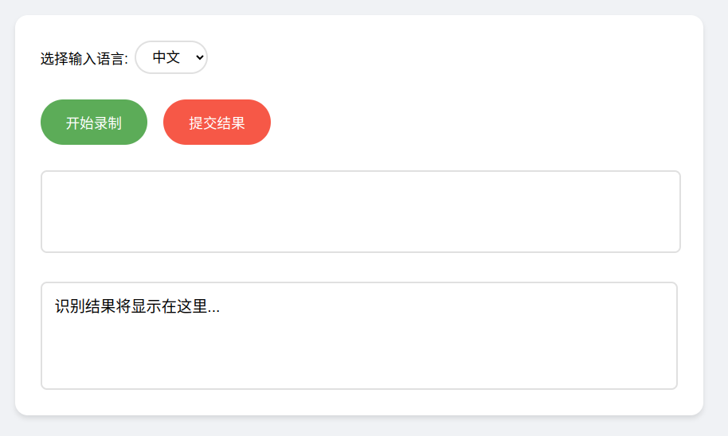

## 使用

### 开启语音识别前端

在本目录启动一个 HTTP服务器，提供静态文件访问，输入：

```shell
python -m http.server 8000
```

在chrome浏览器中打开`http://localhost:8000/`，进入如下界面：



点击提交结果后将向服务端发送序列`<eof>`

### 开启字符处理后端

安装通信库：
```shell
sudo apt update
sudo apt install libwebsockets-dev
```

启动**C服务端**：
```shell
cd C/

# 默认启动设置
# 默认通信端口 8080
# 默认发送频率 0.3s/token
# 默认解析语言 中文
make run

# 自定义token投送时间，单位s
make
./asr --send_delay 0.5

# 自定义通信端口，谨慎使用，需要与前端框架同步
make
./asr --port 1234

# 自定义解析语言，请与前端框架同步
make
./asr --lang en
./asr --lang zh 
```
启动**C++服务端**：
```shell
cd C++/

# 默认启动设置
# 默认通信端口 8080
# 默认发送频率 0.3s/token
# 默认解析语言 中文
make run

# 自定义token投送时间，单位s
make
./asr --send_delay 0.5

# 自定义通信端口，谨慎使用，需要与前端框架同步
make
./asr --port 1234

# 自定义解析语言，请与前端框架同步
make
./asr --lang en
./asr --lang zh 
```

服务端在收到文本后，将以固定频率向外打印/发送字符，见`C/asr.c send_token`、`C++/asr.cpp send_word`
若收到`<eos>、<eof>`，视作特殊token，直接打印/发送

### 注意事项

- 需要使用chrome浏览器打开前端页面

- 需要麦克风设备支持

---

## TODO

- [x] 扩展对Windows平台的兼容性，使用支持Windows平台的线程库
    - C++实现中，`#include <thread>`，是支持Windows平台的线程库
- [ ] C++实现中，目前存在少量内存泄漏问题
- [ ] 扩展对端侧ASR模型的支持
